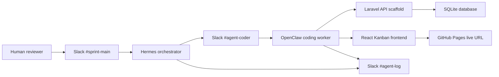

# Architecture

## Agent roles

Hermes is the brain. It owns planning, memory recall, status updates, human approval points, and assigning coding tasks.

OpenClaw is the hands. It owns implementation work, local execution, test runs, and reporting back in the worker channel.

## Slack channels

| Channel | Purpose |
| --- | --- |
| `#sprint-main` | Human talks to Hermes. Plans and decisions land here. |
| `#agent-coder` | Hermes assigns coding tasks. OpenClaw works and reports here. |
| `#agent-log` | Audit trail, raw activity, and autonomous health-check output. |

The current evidence uses `#commands` as the human command channel and `#agent-log` as the audit channel. The production channel scheme above matches the private qualifier handbook.

## Model routing

Planned free routing:

- Hermes planning: Groq `openai/gpt-oss-120b` or Gemini `gemini-2.5-flash`.
- OpenClaw coding: Ollama `qwen2.5-coder` or Groq `openai/gpt-oss-20b`.

Reasoning: use the stronger free model for planning and the cheaper/local model for repetitive implementation.

## App architecture

