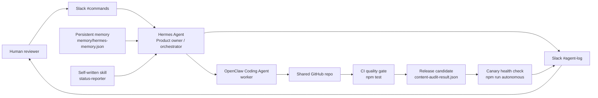

# Architecture

## Role boundaries

Hermes owns planning, task decomposition, memory recall, status reporting, and human approval points.

OpenClaw owns implementation, local execution, tests, and worker output.

The agents communicate only through the chat layer. In this dry run, Markdown channel files stand in for Slack. In the live qualifier, use the same channel names in Slack and preserve screenshots or exports.

## Quality gate

The CI gate is intentionally small:

- The content audit must classify tone.
- The output must include the top three keywords requested in the follow-up.
- The health check must pass.

This is enough to prove the loop without overbuilding before the qualifier deadline.
